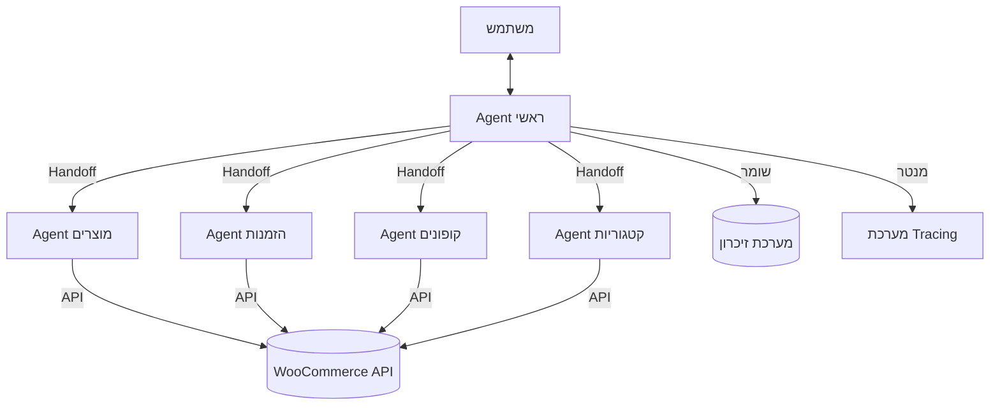

# תוכנית מפורטת לבניית מערכת AI Agents לניהול חנות WooCommerce

## תוכן עניינים

1. [מבוא ומטרות](#1-מבוא-ומטרות)
2. [ארכיטקטורה כללית](#2-ארכיטקטורה-כללית)
3. [רכיבי המערכת](#3-רכיבי-המערכת)
   - [3.1 Agent ראשי](#31-agent-ראשי)
   - [3.2 Agent מוצרים](#32-agent-מוצרים)
   - [3.3 Agent הזמנות](#33-agent-הזמנות)
   - [3.4 Agent קופונים](#34-agent-קופונים)
   - [3.5 Agent קטגוריות](#35-agent-קטגוריות)
4. [מבנה הקוד](#4-מבנה-הקוד)
5. [התממשקות עם WooCommerce API](#5-התממשקות-עם-woocommerce-api)
6. [מימוש מפורט של הרכיבים](#6-מימוש-מפורט-של-הרכיבים)
   - [6.1 קובץ config.py](#61-קובץ-configpy)
   - [6.2 קובץ main.py](#62-קובץ-mainpy)
   - [6.3 מודול agents](#63-מודול-agents)
   - [6.4 מודול api](#64-מודול-api)
   - [6.5 מודול tools](#65-מודול-tools)
   - [6.6 מודול memory](#66-מודול-memory)
   - [6.7 מודול utils](#67-מודול-utils)
7. [תהליך הפיתוח](#7-תהליך-הפיתוח)
8. [בדיקות ואבטחת איכות](#8-בדיקות-ואבטחת-איכות)
9. [הוראות הפעלה](#9-הוראות-הפעלה)
10. [הרחבות עתידיות](#10-הרחבות-עתידיות)

## 1. מבוא ומטרות

מערכת AI Agents לניהול חנות WooCommerce היא מערכת מבוססת OpenAI Agents שמאפשרת ניהול מלא של חנות WooCommerce באמצעות שיחת צ'אט בעברית. המערכת מורכבת ממספר agents מתמחים, כל אחד אחראי על תחום ספציפי בחנות, ו-agent ראשי שמנתב את בקשות המשתמש ל-agent המתאים.

### מטרות המערכת:

1. **פישוט ניהול החנות**: לאפשר למשתמשים לנהל את חנות ה-WooCommerce שלהם באמצעות שיחת צ'אט טבעית בעברית
2. **אוטומציה של פעולות שגרתיות**: לאפשר ביצוע פעולות שגרתיות כמו הוספת מוצרים, עדכון מלאי, וניהול הזמנות בצורה פשוטה ומהירה
3. **הנגשת ניהול החנות**: להפוך את ניהול החנות לנגיש גם למשתמשים שאינם בעלי ידע טכני
4. **שיפור היעילות**: לחסוך זמן ומאמץ בניהול החנות

### יתרונות המערכת:

1. **ממשק טבעי**: המשתמש יכול לתקשר עם המערכת בשפה טבעית (עברית)
2. **מבנה מודולרי**: כל agent מתמחה בתחום ספציפי, מה שמאפשר הרחבה קלה של המערכת
3. **זיכרון**: המערכת זוכרת את היסטוריית השיחה ומידע חשוב
4. **אבטחה**: המערכת מבקשת אישור לפני ביצוע פעולות חשובות
5. **ניטור**: מערכת ה-Tracing מאפשרת ניטור ודיבוג של פעולות המערכת

## 2. ארכיטקטורה כללית

המערכת בנויה בארכיטקטורת agents מרובים, עם agent ראשי שמנהל את השיחה עם המשתמש ומעביר משימות ל-agents מתמחים באמצעות מנגנון handoff.



### תהליך עבודה בסיסי:

1. המשתמש שולח הודעה ל-Agent הראשי
2. ה-Agent הראשי מנתח את ההודעה ומחליט איזה agent מתמחה צריך לטפל בה
3. ה-Agent הראשי מעביר את המשימה ל-agent המתאים באמצעות handoff
4. ה-Agent המתמחה מבצע את המשימה באמצעות כלים (tools) שמתקשרים עם WooCommerce API
5. התוצאה מוחזרת למשתמש דרך ה-Agent הראשי
6. המידע החשוב נשמר במערכת הזיכרון לשימוש עתידי
7. כל התהליך מתועד במערכת ה-Tracing לצורכי ניטור ודיבוג

## 3. רכיבי המערכת

### 3.1 Agent ראשי

ה-Agent הראשי הוא נקודת הכניסה למערכת. הוא אחראי על:

- קבלת פניות מהמשתמש בשפה טבעית (עברית)
- הבנת הכוונה של המשתמש
- העברת המשימה ל-agent המתאים באמצעות handoff
- בקשת אישור מהמשתמש לפני ביצוע פעולות חשובות
- שמירת היסטוריית השיחה במערכת הזיכרון
- ניטור הפעילות באמצעות מערכת ה-Tracing

**הוראות ל-Agent הראשי:**
```
אתה עוזר לניהול חנות WooCommerce בעברית.
תפקידך לקבל בקשות מהמשתמש ולהעביר אותן ל-agent המתאים:
- אם הבקשה קשורה למוצרים, העבר ל-product_expert
- אם הבקשה קשורה להזמנות, העבר ל-order_expert
- אם הבקשה קשורה לקופונים, העבר ל-coupon_expert
- אם הבקשה קשורה לקטגוריות, העבר ל-category_expert

לפני ביצוע פעולות חשובות כמו מחיקה או עדכון מחיר, בקש אישור מהמשתמש.
```

### 3.2 Agent מוצרים

ה-Agent למוצרים מתמחה בכל הפעולות הקשורות למוצרים בחנות WooCommerce:

- הוספת מוצר חדש
- עריכת מוצר קיים
- מחיקת מוצר
- עדכון מלאי
- עדכון מחירים
- הוספת תמונות למוצר
- ניהול וריאציות של מוצרים
- חיפוש מוצרים

**הוראות ל-Agent מוצרים:**
```
אתה מומחה למוצרים בחנות WooCommerce.
תפקידך לעזור בניהול מוצרים בחנות:
- הוספת מוצרים חדשים
- עריכת מוצרים קיימים
- מחיקת מוצרים
- עדכון מלאי
- עדכון מחירים
- ניהול תמונות מוצר
- ניהול וריאציות

השתמש בכלים המתאימים לביצוע הפעולות.
```

### 3.3 Agent הזמנות

ה-Agent להזמנות מתמחה בכל הפעולות הקשורות להזמנות בחנות WooCommerce:

- צפייה בהזמנות
- עדכון סטטוס הזמנה
- ביטול הזמנה
- יצירת הזמנה חדשה
- חיפוש הזמנות לפי פרמטרים שונים
- הפקת חשבוניות

**הוראות ל-Agent הזמנות:**
```
אתה מומחה להזמנות בחנות WooCommerce.
תפקידך לעזור בניהול הזמנות בחנות:
- צפייה בהזמנות
- עדכון סטטוס הזמנה
- ביטול הזמנה
- יצירת הזמנה חדשה
- חיפוש הזמנות
- הפקת חשבוניות

השתמש בכלים המתאימים לביצוע הפעולות.
```

### 3.4 Agent קופונים

ה-Agent לקופונים מתמחה בכל הפעולות הקשורות לקופונים בחנות WooCommerce:

- יצירת קופון חדש
- עריכת קופון קיים
- מחיקת קופון
- הגדרת תנאי שימוש בקופון
- הגדרת תאריכי תוקף

**הוראות ל-Agent קופונים:**
```
אתה מומחה לקופונים בחנות WooCommerce.
תפקידך לעזור בניהול קופונים בחנות:
- יצירת קופונים חדשים
- עריכת קופונים קיימים
- מחיקת קופונים
- הגדרת תנאי שימוש
- הגדרת תאריכי תוקף

השתמש בכלים המתאימים לביצוע הפעולות.
```

### 3.5 Agent קטגוריות

ה-Agent לקטגוריות מתמחה בכל הפעולות הקשורות לקטגוריות בחנות WooCommerce:

- יצירת קטגוריה חדשה
- עריכת קטגוריה קיימת
- מחיקת קטגוריה
- ארגון היררכיית קטגוריות
- שיוך מוצרים לקטגוריות

**הוראות ל-Agent קטגוריות:**
```
אתה מומחה לקטגוריות בחנות WooCommerce.
תפקידך לעזור בניהול קטגוריות בחנות:
- יצירת קטגוריות חדשות
- עריכת קטגוריות קיימות
- מחיקת קטגוריות
- ארגון היררכיית קטגוריות
- שיוך מוצרים לקטגוריות

השתמש בכלים המתאימים לביצוע הפעולות.
```

## 4. מבנה הקוד

מבנה הקוד של המערכת מאורגן באופן מודולרי, עם הפרדה ברורה בין הרכיבים השונים:

```
woo_agent/
├── README.md                     # תיעוד הפרויקט
├── requirements.txt              # תלויות הפרויקט
├── config.py                     # הגדרות תצורה
├── main.py                       # נקודת הכניסה למערכת
├── agents/
│   ├── __init__.py
│   ├── main_agent.py             # Agent ראשי
│   ├── product_agent.py          # Agent מוצרים
│   ├── order_agent.py            # Agent הזמנות
│   ├── coupon_agent.py           # Agent קופונים
│   └── category_agent.py         # Agent קטגוריות
├── api/
│   ├── __init__.py
│   ├── woocommerce_client.py     # מחלקה להתחברות ל-WooCommerce API
│   ├── product_api.py            # פונקציות API למוצרים
│   ├── order_api.py              # פונקציות API להזמנות
│   ├── coupon_api.py             # פונקציות API לקופונים
│   └── category_api.py           # פונקציות API לקטגוריות
├── tools/
│   ├── __init__.py
│   ├── product_tools.py          # כלים למוצרים
│   ├── order_tools.py            # כלים להזמנות
│   ├── coupon_tools.py           # כלים לקופונים
│   └── category_tools.py         # כלים לקטגוריות
├── memory/
│   ├── __init__.py
│   └── vector_store.py           # מערכת זיכרון וקטורי
├── utils/
│   ├── __init__.py
│   ├── tracing.py                # פונקציות לניטור ודיבוג
│   └── validators.py             # פונקציות לוולידציה
└── tests/
    ├── __init__.py
    ├── test_main_agent.py
    ├── test_product_agent.py
    └── ...
```

### תלויות הפרויקט (requirements.txt):

```
openai>=1.0.0
woocommerce>=3.0.0
chromadb>=0.4.0
pydantic>=2.0.0
python-dotenv>=1.0.0
```

## 5. התממשקות עם WooCommerce API

המערכת מתממשקת עם WooCommerce באמצעות ה-REST API הרשמי של WooCommerce. אנחנו משתמשים בספריית `woocommerce` הרשמית של Python להתחברות ל-API.

### הגדרת הקישור ל-WooCommerce API:

כדי להתחבר ל-WooCommerce API, נדרשים הפרטים הבאים:
- URL של האתר
- Consumer Key
- Consumer Secret

פרטים אלה מוגדרים בקובץ התצורה `config.json`:

```json
{
  "woocommerce": {
    "url": "https://example.com",
    "consumer_key": "ck_XXXXXXXXXXXXXXXXXXXX",
    "consumer_secret": "cs_XXXXXXXXXXXXXXXXXXXX"
  },
  "openai": {
    "api_key": "sk-XXXXXXXXXXXXXXXXXXXX"
  }
}
```

### מחלקת WooCommerceClient:

מחלקת `WooCommerceClient` מספקת ממשק נוח לעבודה עם WooCommerce API:

```python
# api/woocommerce_client.py
from woocommerce import API

class WooCommerceClient:
    def __init__(self, url, consumer_key, consumer_secret):
        self.wcapi = API(
            url=url,
            consumer_key=consumer_key,
            consumer_secret=consumer_secret,
            version="wc/v3"
        )
    
    # מוצרים
    def get_products(self, **params):
        return self.wcapi.get("products", params=params).json()
    
    def get_product(self, product_id):
        return self.wcapi.get(f"products/{product_id}").json()
    
    def create_product(self, data):
        return self.wcapi.post("products", data).json()
    
    def update_product(self, product_id, data):
        return self.wcapi.put(f"products/{product_id}", data).json()
    
    def delete_product(self, product_id, force=True):
        return self.wcapi.delete(f"products/{product_id}", params={"force": force}).json()
    
    # הזמנות
    def get_orders(self, **params):
        return self.wcapi.get("orders", params=params).json()
    
    def get_order(self, order_id):
        return self.wcapi.get(f"orders/{order_id}").json()
    
    def create_order(self, data):
        return self.wcapi.post("orders", data).json()
    
    def update_order(self, order_id, data):
        return self.wcapi.put(f"orders/{order_id}", data).json()
    
    def delete_order(self, order_id, force=True):
        return self.wcapi.delete(f"orders/{order_id}", params={"force": force}).json()
    
    # קופונים
    def get_coupons(self, **params):
        return self.wcapi.get("coupons", params=params).json()
    
    def get_coupon(self, coupon_id):
        return self.wcapi.get(f"coupons/{coupon_id}").json()
    
    def create_coupon(self, data):
        return self.wcapi.post("coupons", data).json()
    
    def update_coupon(self, coupon_id, data):
        return self.wcapi.put(f"coupons/{coupon_id}", data).json()
    
    def delete_coupon(self, coupon_id, force=True):
        return self.wcapi.delete(f"coupons/{coupon_id}", params={"force": force}).json()
    
    # קטגוריות
    def get_categories(self, **params):
        return self.wcapi.get("products/categories", params=params).json()
    
    def get_category(self, category_id):
        return self.wcapi.get(f"products/categories/{category_id}").json()
    
    def create_category(self, data):
        return self.wcapi.post("products/categories", data).json()
    
    def update_category(self, category_id, data):
        return self.wcapi.put(f"products/categories/{category_id}", data).json()
    
    def delete_category(self, category_id, force=True):
        return self.wcapi.delete(f"products/categories/{category_id}", params={"force": force}).json()
```

## 6. מימוש מפורט של הרכיבים

### 6.1 קובץ config.py

קובץ `config.py` אחראי על טעינת הגדרות התצורה מקובץ JSON:

```python
# config.py
import os
import json
from dotenv import load_dotenv

# טעינת משתני סביבה מקובץ .env
load_dotenv()

def load_config(config_file="config.json"):
    """טוען את הגדרות התצורה מקובץ JSON."""
    if not os.path.exists(config_file):
        # אם קובץ התצורה לא קיים, ננסה להשתמש במשתני סביבה
        return {
            "woocommerce": {
                "url": os.environ.get("WOO_URL"),
                "consumer_key": os.environ.get("WOO_CONSUMER_KEY"),
                "consumer_secret": os.environ.get("WOO_CONSUMER_SECRET")
            },
            "openai": {
                "api_key": os.environ.get("OPENAI_API_KEY")
            }
        }
    
    with open(config_file, "r", encoding="utf-8") as f:
        return json.load(f)

def get_woocommerce_config():
    """מחזיר את הגדרות ה-WooCommerce."""
    config = load_config()
    
    # בדיקה שכל ההגדרות הנדרשות קיימות
    required_keys = ["url", "consumer_key", "consumer_secret"]
    for key in required_keys:
        if key not in config.get("woocommerce", {}) or not config["woocommerce"][key]:
            raise ValueError(f"חסר {key} בהגדרות ה-WooCommerce")
    
    return config["woocommerce"]

def get_openai_config():
    """מחזיר את הגדרות ה-OpenAI."""
    config = load_config()
    
    # אם אין הגדרות ב-config, ננסה לקחת מסביבת העבודה
    if "openai" not in config or not config["openai"].get("api_key"):
        api_key = os.environ.get("OPENAI_API_KEY")
        if not api_key:
            raise ValueError("חסר OPENAI_API_KEY בהגדרות או בסביבת העבודה")
        
        return {"api_key": api_key}
    
    return config["openai"]
```

### 6.2 קובץ main.py

קובץ `main.py` הוא נקודת הכניסה למערכת:

```python
# main.py
import os
from openai import OpenAI
from agents.main_agent import MainAgent
from utils.tracing import setup_tracing_directory
from config import get_openai_config

def main():
    # הגדרת ה-API key של OpenAI
    openai_config = get_openai_config()
    api_key = openai_config["api_key"]
    
    # יצירת לקוח OpenAI
    client = OpenAI(api_key=api_key)
    
    # הגדרת תיקיית ה-tracing
    setup_tracing_directory()
    
    # יצירת ה-agent הראשי
    agent = MainAgent(client)
    
    print("ברוכים הבאים ל-WooCommerce Agent!")
    print("הקלד 'exit' כדי לצאת")
    
    # לולאת שיחה
    while True:
        user_input = input("\nאתה: ")
        
        if user_input.lower() == "exit":
            break
        
        try:
            response = agent.run(user_input)
            print(f"\nAgent: {response}")
        except Exception as e:
            print(f"\nשגיאה: {str(e)}")

if __name__ == "__main__":
    main()
```

### 6.3 מודול agents

#### 6.3.1 agents/main_agent.py

```python
# agents/main_agent.py
from openai import OpenAI
from openai.agents import Agent, Handoff, Guardrail, Thread, Trace
from memory.vector_store import VectorStore
from utils.tracing import save_trace
from agents.product_agent import create_product_agent
from agents.order_agent import create_order_agent
from agents.coupon_agent import create_coupon_agent
from agents.category_agent import create_category_agent

class MainAgent:
    def __init__(self, client, model="gpt-4o"):
        self.client = client
        self.model = model
        self.memory = VectorStore(client)
        self.thread = Thread()
        
        # הגדרת ה-agents המתמחים
        self.product_agent = create_product_agent(client, model)
        self.order_agent = create_order_agent(client, model)
        self.coupon_agent = create_coupon_agent(client, model)
        self.category_agent = create_category_agent(client, model)
        
        # הגדרת guardrail לאישור פעולות חשובות
        self.confirmation_guardrail = Guardrail(
            client=client,
            model=model,
            instructions="""
            בדוק אם הפעולה דורשת אישור מהמשתמש.
            פעולות שדורשות אישור:
            - מחיקת מוצר, הזמנה, קופון או קטגוריה
            - עדכון מחיר של מוצר
            - ביטול הזמנה
            אם הפעולה דורשת אישור והמשתמש לא אישר במפורש, החזר False עם הסבר.
            אחרת, החזר True.
            """
        )
        
        # הגדרת ה-agent הראשי
        self.agent = Agent(
            client=client,
            model=model,
            instructions="""
            אתה עוזר לניהול חנות WooCommerce בעברית.
            תפקידך לקבל בקשות מהמשתמש ולהעביר אותן ל-agent המתאים:
            - אם הבקשה קשורה למוצרים, העבר ל-product_expert
            - אם הבקשה קשורה להזמנות, העבר ל-order_expert
            - אם הבקשה קשורה לקופונים, העבר ל-coupon_expert
            - אם הבקשה קשורה לקטגוריות, העבר ל-category_expert
            
            לפני ביצוע פעולות חשובות כמו מחיקה או עדכון מחיר, בקש אישור מהמשתמש.
            """,
            handoffs=[
                Handoff(name="product_expert", agent=self.product_agent, description="מומחה למוצרים"),
                Handoff(name="order_expert", agent=self.order_agent, description="מומחה להזמנות"),
                Handoff(name="coupon_expert", agent=self.coupon_agent, description="מומחה לקופונים"),
                Handoff(name="category_expert", agent=self.category_agent, description="מומחה לקטגוריות")
            ],
            guardrails=[self.confirmation_guardrail]
        )
    
    def run(self, user_input):
        # הפעלת ה-agent הראשי עם tracing
        with Trace.capture() as trace:
            response = self.agent.run(user_input, thread=self.thread)
            
            # שמירת המידע החשוב בזיכרון
            self._update_memory(user_input, response.content)
            
            # שמירת ה-trace לניטור
            trace_file = save_trace(trace)
            
        return response.content
    
    def _update_memory(self, user_input, response):
        """שומר את המידע החשוב בזיכרון."""
        self.memory.add_document(f"User: {user_input}\nAssistant: {response}")
```

#### 6.3.2 agents/product_agent.py

```python
# agents/product_agent.py
from openai.agents import Agent, Tool
from tools.product_tools import get_product, list_products, create_product
